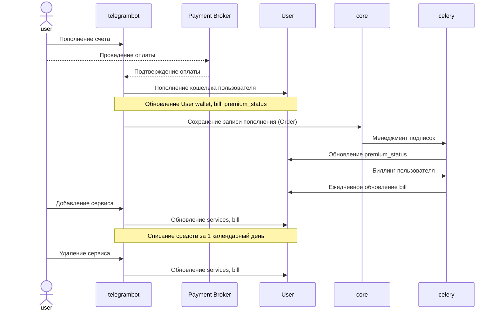
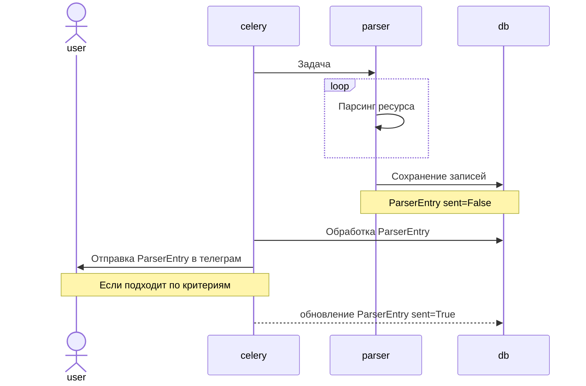
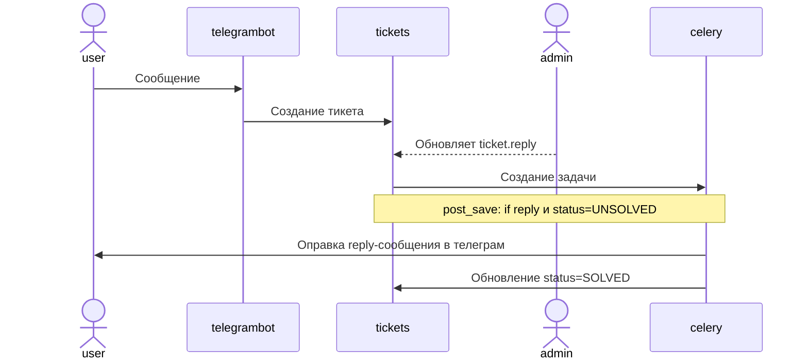

# [TelegramNotify](https://telegramnotify.ru/)

    Телеграм парсер-сервис оповещений по ключевым словам

    Стэк: Django 4.1, Telegram API, asyncio, selenium, celery, docker

## TODO

---

- Доработать бизнес систему (биллинг)
- Проанализировать возможность привязать сообщения тг-бота к бд
- Refactor SenderBot
- Refactor import mud-ball

- TelegramBot - доработка кнопок команды /settings
- Подключить магазин
- Добавление новых парсер-сервисов
- Реклама по средству прокси-ботов
- Реферальная система
- PostgreSQL Backups найти подходящее решение без aws.s3
- В продакшене научиться выводить flower/traefik dashboard

## Архитектура

---
### Бизнес система

---
### Парсер сервисы

---
### Система поддержки

## Testing

---

### Type checks

Running type checks with mypy:

    mypy telegramnotify

### Test coverage

To run the tests, check your test coverage, and generate an HTML coverage report:

    coverage run -m pytest
    coverage html
    open htmlcov/index.html

#### Running tests with pytest

    pytest
    pytest -v -m slow
    pytest -v -m "not slow"

## Frontend
---

    Gulp + Sass

    # Установка:
    npm install
    # Запустить сервер
    gulp

## Deployment

---

### First steps

1. Создать желаемый VPS

2. Подключить домен к VPS

   1. Обновить указатели домена `ns.*`
   2. Добавить запись `CNAME` (если потребуется)

3. Подключиться по SSH (putty или консоль)
   1. `ssh user@host-ip`

### Setup VPS

1. Обновить linux/ubuntu сервер

   - `sudo apt update && sudo apt upgrade -y`

2. Обновить часовой пояс

   1. Проверить текущее время
      - `timedatectl`
   2. Доступные пояса
      - `timedatectl list-timezones`
   3. Задать часовой пояс
      - `sudo timedatectl set-timezone Europe/Moscow`

3. Установить python, pip, git

   - `sudo apt install python3.10`
   - `sudo apt install python3-pip`
   - `sudo apt install git`
   -
   - `sudo apt install python3.10 python3-pip git -y`

4. Установить Docker

   - Инструкция [Docker ubuntu](https://docs.docker.com/engine/install/ubuntu/)
   - На джино это упрощенно, через Пакеты приложений + опцию iptables
   - Проверка: `docker run hello-world`

5. Установка и настройка venv или [virtualenvwrapper](https://virtualenvwrapper.readthedocs.io/en/latest/) (Если потребуется)

   1. venv
      - `apt install python3.10-venv`
      - `python3 -m venv venv`
      - `venv\Scripts\activate`
   2. virtualenvwrapper
      - `pip install virtualenvwrapper`
      - `export VIRTUALENVWRAPPER_PYTHON=/usr/bin/python3.10`
      - `export WORKON_HOME=~/Envs`
      - `export VIRTUALENVWRAPPER_VIRTUALENV=/usr/local/bin/virtualenv`
      - `source /usr/local/bin/virtualenvwrapper.sh`

### Setup Project

1. Пулл и инициализация git

   - `git init`
   - VPS `ssh-keygen`
   - Добавить публичный ключ vps в github ssh `{repo}/settings/keys/new`
   - `git remote add origin git@github.com:DmitryPi/telegramnotify.git`
   - `git pull origin main`

2. Добавить переменные production в `.envs/.prod`

3. Билд docker проекта

   1. Билд
      - `docker-compose -f production.yml build`
   2. Миграция бд
      - `docker-compose -f production.yml run --rm django python manage.py migrate`
   3. Создать суперюзера
      - `docker-compose -f production.yml run --rm django python manage.py createsuperuser`
   4. Запуск
      - `docker-compose -f production.yml up`
   5. Ребилд
      - `docker-compose -f production.yml up --build`

4. Проверить логин/регистрацию

5. Проверить mailgun/sentry

6. supervisord
   1. Установка
      `pip install supervisor`
   2. Старт
      - `supervisord`
   3. Стоп
      - `supervisorctl stop all`
      - `sudo unlink /tmp/supervisor.sock` или `sudo unlink /var/run/supervisor.sock`
   4. Дополнительные команды
      - `supervisorctl status`

### Полезные команды:

    # containers status
    docker-compose -f production.yml ps

    # containers logs
    docker-compose -f production.yml logs

    # remove unused(dangling) images
    docker image prune

    # django shell run
    docker-compose -f production.yml run --rm django python manage.py shell

    # django dump db data
    docker-compose -f production.yml run --rm django bash
    python -Xutf8 manage.py dumpdata {app}.{Model -o data.json
      # Открыть вторую консоль, сохраняя сессию в старой
      docker cp 5f5cecd3798e:/app/data.json ./data.json

    # If you want to scale application
    # ❗ Don’t try to scale postgres, celerybeat, or traefik
    docker-compose -f production.yml up --scale django=4
    docker-compose -f production.yml up --scale celeryworker=2

### Возможные ошибки:

1. ACME certificate failure

   - Возможен конфликт хост сервиса, если он предоставляет функцию ssl сертификации
   - Let's encrypt рейт лимит достигнут (5 в неделю) - [проверить](https://crt.sh/)

2. ERR_TOO_MANY_REDIRECTS

   - Происходит из-за рекурсии портов 80<-->443(http-https)

3. Traefik 404 error

   - Конфликт ssl-сертификатов
   - Анализ: изменить лог-левел на DEBUG в traefik.yml
   - Решение: убрать tls настройки из traefik.yml

4. Django POST 403 csrf - Origin checking failed
   - В production.py обновить CSRF_TRUSTED_ORIGINS

## Версии

---

1.2.0 - (19.01.2023)

- Редизайн архитектуры проекта

1.1.0 - (18.01.2023)

- Редизайн веб-версии сайта
- Система обратной связи
- Покрытие тестами

1.0.0 - release - (10.01.2023)

- Регистрация пользователя
- Личный кабинет пользователя в телеграм
- Доступно обновление настроек пользователем
- Подписки на сервис: Expired, Trial, Regular, Permanent
- Реализованные сервисы подписки: FL.ru
- Возможность обратной связи по средству телеграм и админки джанго
- Контроль задач в celery
- Задачи на парсинг сервисов
- Задачи по обновление подписок
